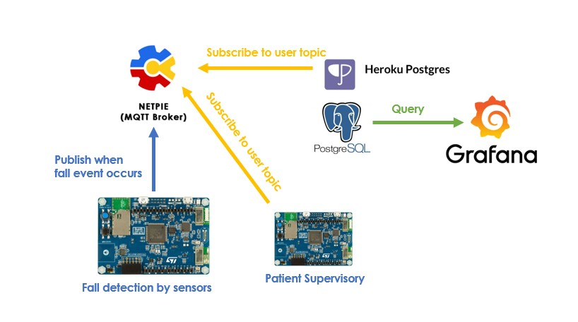
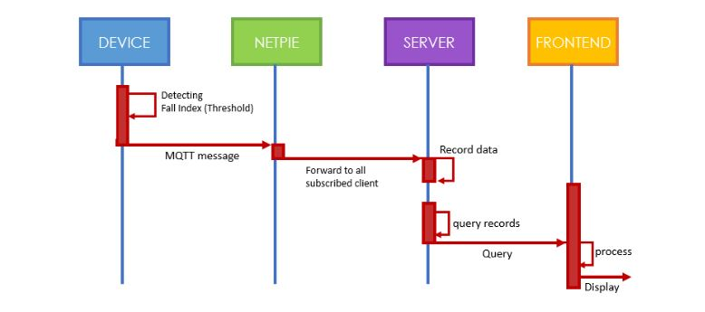
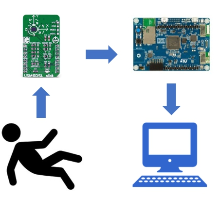
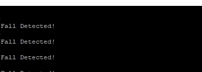
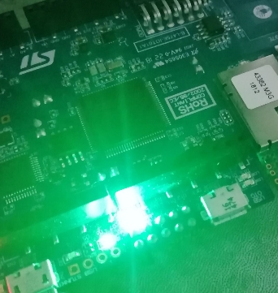
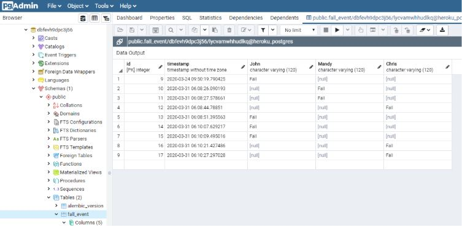
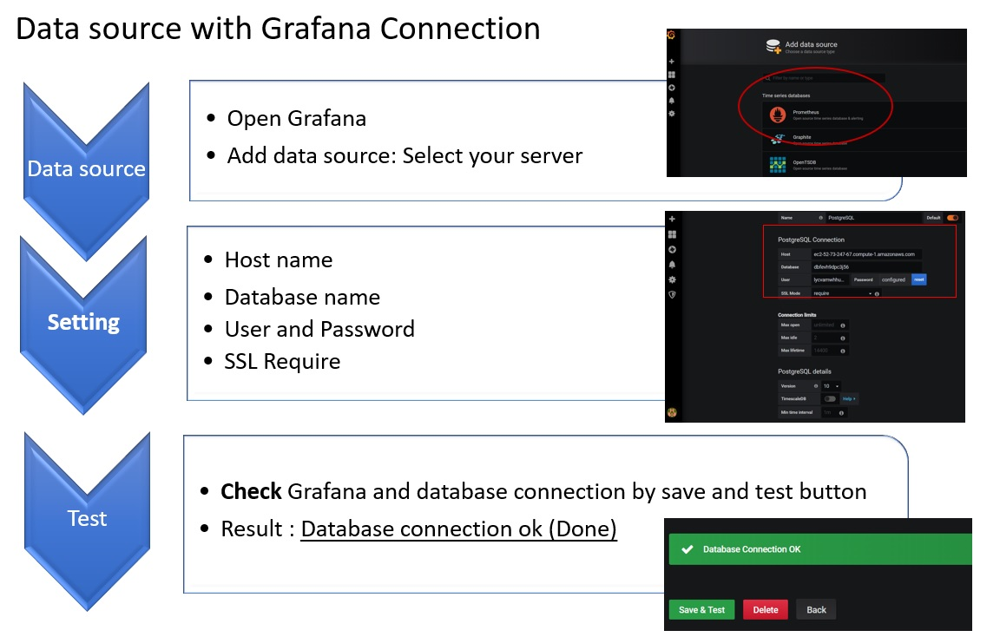
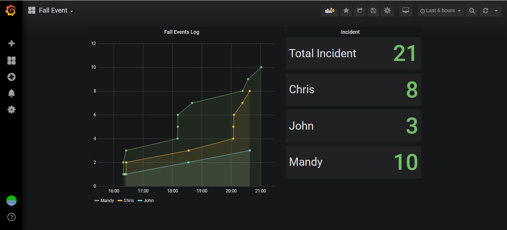

# Fall detection
This device was created to detect the fall of the elderly. Wherever the elderly are, they are able to detect. and alert when there is a fall on the cloud to let the caretaker know

Our system has 3 main components, namely sensor boards that detect fall on the elderly, MQTT and Dashbord.

**System Design**

**Software Design**

**Software Detailed Design**

## Project Members
#### Device Team
- Kanittha    Rungyaem    6214552611
- Jantakarn   Makma       6214552620
- Suphidchaya Atthaporn   6222040427

#### Cloud Team
- Phat        Burana        6222040179
- Pattareeya  Piravechsakul 6214552654
- Pakpoom     Imphaiboon    6222040419

## Table of Contents
1. [Device](#Device)
2. [Cloud](#Cloud)
3. [Dashboard](#Dashboard)
4. [Test case](#Testcase)

## Device
### Requirements
1. DEVICE shall operate as a measure acceleration and angle of each axis
2. DEVICE shall decide wether the meased data is a fall event or not
3. DEVICE shall publish MQTT messages reporting fall events

### Device design
When elder wearing the device and activate. Accelerometer measure the acceleration of each axis, gyroscope measure the angle and compare the acceleration and angle of each axis for find the transformation of each axis. For fall detection of elder when detecting the fall of elder, Device will turn on LED light temporarily and show "Fall Detection!" on monitor.

### Getting start
Clone project, open the terminal and run the following commands

	git clone  https://github.com/Rungyaem-K/Project

and add LSM6DSL, mbed mqtt, and wifi library respectively

	git add https://developer.mbed.org/teams/ST/code/LSM6DSL/#20ccff7dd652
	git add https://github.com/ARMmbed/mbed-mqtt/#769f0b959957ec53efc1e3be8e82e125e12010b2
	git add https://github.com/ARMmbed/wifi-ism43362/#1978369b2310ea3955715b67869b717fd224a74c

When library is complete Next, run the program by writing as follows

	mbed compile -m DISCO_L475VG_IOT01A -t GCC_ARM --source . --source ../mbed-os --source ../LSM6DSL --source ../mbed-mqtt --source ../wifi-ism43362 --flash

### Result
After running the program and the elderly falling on the screen will show "Fall Detection!"

when "Fall Detection!" show on the monitor. On the board, there will be a led light.

## Cloud
### Requirements
1. SERVER shall run on cloud
2. SERVER shall subscribe to all incoming fall events MQTT messages
3. SERVER shall record each events with it’s corresponding datetime into the database
4. SERVER shall provide REST endpoint for querying all occurences
### Could Design
##### Heroku Python app
- Subscribe to fall alert topic of the patient
  * @msg/fallevent/<patient_name>  (Specific)
  * @msg/fallevent/#               (Multi-level wildcard)
- Receive a fall message then classify which user topic it belongs to.
- Log the fall event with the corresponding event time into the database. 
##### PostgreSQL Database 
- Directed by the database own URL from Heroku Postgres addon.
- Contains only one table. Each patient occupies 1 column.
- The patient supervisory could also be notified by subscribe to all or specific patient.
- The application are also able to summarize the data in the database to a appropriate type to a periodically request dashboard.

## Dashboard
#### Requirements
#### FRONTEND shall run as a Grafana
- Use Grafana dashboard to directly connect PostgreSQL server. 
- Use all data from PostgreSQL server.

The procedure for testing PostgreSQL server and Grafana dashboard

#### FRONTEND shall provide cell that perform data analytics and visualization of occurence
- The Dashboard can show fall event count in each patient during time period that you want to know.
- The Dashboard can show graph and statistic of patient comparing for further analysis.

In our group, using **Grafana dashboard** for receiving the data from PostgreSQL

First, select data source with PostgreSQL
.JPG)

Then, create the dashboard and choose visualization types to a appropriate type to a periodically request dashboard.

## Testcase
### Test case: Not Fall Detection device
- Test Case ID: 001
- Description
	- This test shall show when the elder performs normal movement, there will not notify on display.
- Procedure
	1. Connect boart to computer
	2. Test the movement by holding the board and moving slowly.
- Test Device
	- Check movement accuracy
- Expected Result
	- Display shall not show Fall detected because display shall notify only when the elder fall.

### Test case: Fall Detection
- Test Case ID: #001
- Description
	- Examine the fall of the elderly, which will be detected when the elderly fall.
- Procedure
	1. Connect the board to the computer to test for fall.
	2. Test by dropped the board to simulate the fall.
- Test Device
	- Check movement accuracy
- Expected Result
	- Fall detected was a show in display and the board will have a bright LED for about 2 seconds.

### Test case: Test MQTT
- Test Case ID: ##001
- Description
	- Show that MQTT can connect on NETPIE. 
- Procedure
	1. Connect board and MQTT server together.
- Test Device
	- Send Fall Detection message to MQTT.
- Expected Result
	- Show status connected on NETPIE.

### Test Case : Server Data Sorting
- Test Case ID : ###001
- Description
	- This test shall show whether the application handle the incoming MQTT messages correctly with their corresponding database column
- Procedure
	1. Publish a test MQTT messages
	2. Change MQTT topics
	3. Verify data in the database
- Test Data
	- Various MQTT topics
- Expected Result
	- App shall assigned the payload to the database column according to the received MQTT topic

### Test Case : Get Request endpoint
- Test Case ID : ####001
- Description
	- In order to summarize the database, the server needs to provide the correct response for the request
- Procedure
	1. Perform a GET request to the application
	2. Verify the json response
- Test Data
	- Postman (Get request)
- Expected Result
	- Postman should show only fall people’s name and the time when people fall

### Test Case : postgres database to Grafana dashboard test
- Test Case ID : #####001
- Description
	- This test shall show postgres database can be communicate with Grafana dashboard or not.
- Procedure
	1. Postgres database subscribe to MQTT topics.
	2. Grafana add datasource on Postgres database
	3. Grafana query by period 
	4. Verify the data 
- Test Data
	- Data on Postgres database
- Expected Result
	- Grafana able to summarize the data within the database correctly.
